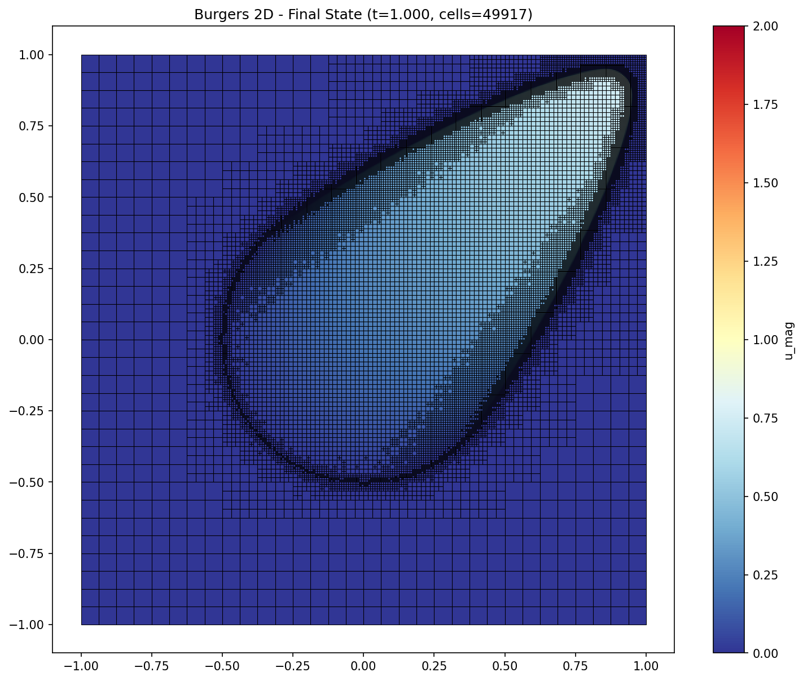

# Sampai - Python Interface for Samurai AMR Library

<p align="center">
  
</p>

[](https://github.com/sbstndb/sampai/actions/workflows/ci.yml)

Python bindings for the **Samurai** library - Adaptive Mesh Refinement (AMR) and Multiresolution Analysis for numerical PDE solvers.

## Status: Standalone Package with Meson Build

**Sampai** (formerly samurai-python) is now a standalone package that **automatically downloads the Samurai C++ library headers from GitHub** during the first build. The build system uses **Meson** for fast, reliable builds while using conda-forge for transitive dependencies.

## Table of Contents

- [Installation](#installation)
- [Quick Start](#quick-start)
- [Development](#development)
- [Documentation](#documentation)
- [Examples](#examples)
- [Gallery](#gallery)
- [Testing](#testing)
- [TODO / Roadmap](#todo--roadmap)
- [Troubleshooting](#troubleshooting)
- [License](#license)

---

## Installation

### Option 1: Install via Conda Environment (Recommended)

Create a new conda environment with all dependencies:

```bash
# Create the environment from the environment file
conda env create -f environment.yml

# Activate the environment
conda activate sampai
```

Or create manually:

```bash
# Create environment with dependencies
conda create -n sampai -c conda-forge python=3.11 meson ninja xtensor fmt cli11 hdf5
conda activate sampai

# Install sampai (samurai headers are auto-downloaded during first build)
pip install .
```

### Option 2: Build from Source with Meson

```bash
# Configure with Meson
meson setup builddir

# Build
meson compile -C builddir

# Install
pip install .
```

For development/editable mode:

```bash
pip install -e .
```

### Option 3: Build with pip

```bash
# pip will use Meson backend
pip install .
```

### Option 4: Build Conda Package

```bash
# Build the conda package
conda build conda-recipe/

# Install locally
conda install --use-local sampai
```

### Verify Installation

```python
import sampai as sam
print(sam.__version__)  # Should print version number
```

---

## MPI Support

Sampai supports **MPI for distributed memory parallelization**. When compiled with MPI, the library automatically distributes meshes and exchanges ghost cells across processes.

### Installation with MPI

```bash
# Create environment with MPI dependencies
conda create -n sampai-mpi -c conda-forge \
  python=3.12 \
  xtensor \
  hdf5="1.14.6=mpi_openmpi*" \
  highfive \
  fmt \
  cli11 \
  meson-python \
  meson \
  ninja \
  pybind11 \
  openmpi \
  mpi4py \
  boost

conda activate sampai-mpi

# Build with MPI support
pip install . --global-option="-Dmpi=true"
```

### Usage

**Same Python code works for both MPI and non-MPI:**

```python
from mpi4py import MPI  # Import first for MPI
import sampai as sam

# Check if MPI is available
try:
    from sampai import mpi
    print(f"MPI: {mpi.size()} processes")
except ImportError:
    print("MPI: not available")

# Create mesh (auto-distributed if MPI)
box = sam.geometry.box([0.0, 0.0], [1.0, 1.0])
mesh = sam.mesh.make(box, min_level=2, max_level=4)

# Update ghosts (auto-exchange if MPI)
u = sam.field.zeros(mesh, "u")
sam.adaptation.update_ghost_mr(u)

# Save (auto-parallel if MPI)
sam.save("output.h5", u)
```

**Run with MPI:**
```bash
# 4 processes
mpiexec -n 4 python simulation.py

# Single process (still uses MPI)
mpiexec -n 1 python simulation.py
```

**Run without MPI:**
```bash
python simulation.py
```

### Important Notes

1. **Separate compilation** - You must compile separately with `-Dmpi=true` for MPI support
2. **Automatic behavior** - When MPI is enabled, mesh distribution and ghost exchange happen automatically
3. **Same API** - Your Python code is identical for both cases
4. **MPI module** - `sampai.mpi` provides `rank()`, `size()`, `barrier()` for MPI queries

---

## Quick Start

Here's a minimal example to get you started:

```python
import sampai as sam

# 1. Create a computational domain
box = sam.geometry.box([0., 0.], [1., 1.])

# 2. Create a mesh with AMR capability
mesh = sam.mesh.make(box, min_level=2, max_level=6)

# 3. Create a field
u = sam.field.scalar(mesh, "u")

# 4. Initialize the field
for cell in mesh.cells():
    u[cell] = initial_condition(cell.center)

# 5. Apply boundary conditions
bc = sam.boundary.dirichlet(u, value=0.0)

# 6. Perform mesh adaptation
MRadapt = sam.adaptation.make_MRAdapt(u)
MRadapt(epsilon=1e-4, regularity=1)
```

For more detailed tutorials, see the [examples/](examples/) directory.

---

## Development

### Setting Up Development Environment

```bash
# Create a conda environment from the environment file
conda env create -f environment.yml
conda activate sampai

# Or create manually
conda create -n sampai-dev -c conda-forge python=3.11 meson ninja xtensor fmt cli11 hdf5
conda activate sampai-dev
pip install numpy pytest black isort ruff mypy

# Install in editable mode
pip install -e .
```

### Building from Source

#### Using Meson directly

```bash
# Configure
meson setup builddir

# Build
meson compile -C builddir

# Test
python -c "import sampai; print(sampai.__version__)"
```

### Code Quality

```bash
# Format code
make fmt

# Lint
make lint

# Type check
make check

# Run all checks
make check-all
```

---

## Documentation

### API Documentation

The Python bindings are organized into submodules:

- **`sam.geometry`** - Geometric primitives (`Box`, `DomainBuilder`)
- **`sam.config`** - Mesh configuration (`MeshConfig`, `MRAConfig`)
- **`sam.mesh`** - Mesh types (`UniformMesh`, `MRMesh`)
- **`sam.field`** - Fields (`ScalarField`, `VectorField`)
- **`sam.algorithms`** - Iteration algorithms (`for_each_cell`, `for_each_interval`)
- **`sam.operators`** - Differential operators (`upwind`, `diffusion`)
- **`sam.boundary`** - Boundary conditions (`Dirichlet`, `Neumann`)
- **`sam.adaptation`** - Mesh adaptation (`MRAdapt`, `update_ghost_mr`)
- **`sam.io`** - HDF5 I/O (`save`, `load`)

### Full Documentation

For complete documentation, visit: [https://hpc-math-samurai.readthedocs.io](https://hpc-math-samurai.readthedocs.io)

---

## Examples

The `examples/` directory contains complete, runnable examples:

| Example | Description |
|---------|-------------|
| `advection.py` | 2D advection equation with AMR |
| `burgers.py` | 2D Burgers equation with WENO5 |
| `convection.py` | Linear convection with obstacles |
| `demo_progress.py` | Progress bar demonstration |
| `demo_visualization.py` | Real-time visualization |

Run an example:

```bash
cd examples/
python advection.py
```

---

## Gallery

### Burgers 2D Equation with WENO5

2D Burgers equation solved with WENO5 convection operator and TVD-RK3 time stepping. The simulation demonstrates adaptive mesh refinement (AMR) with multiresolution analysis, automatically refining the mesh where gradients are steep (near the shock). The color represents velocity magnitude.



*Simulation parameters: Domain [-1,1]×[-1,1], min_level=5, max_level=9, ε=2×10⁻⁴, CFL=0.95*

---

## Testing

### Run All Tests

```bash
cd python/
pytest tests/ -v
```

### Run Specific Tests

```bash
# Basic tests
pytest tests/test_basic.py -v

# Field tests
pytest tests/test_field.py -v

# Adaptation tests
pytest tests/test_adapt.py -v
```

### Standalone Tests

For testing the standalone build specifically:

```bash
pytest tests/test_standalone.py -v
```

---

## TODO / Roadmap

- [ ] **MPI support** - Document current MPI support status and future roadmap
- [ ] **Exception hierarchy** - Create custom error types (`MeshError`, `FieldError`, `IOError`) for better error handling
- [ ] **Int32/Int64 support** - Add support for different integer sizes in mesh configurations
- [ ] **Multi-platform CI** - Add macOS and Windows testing, multiple Python versions (3.9-3.13)
- [ ] **Pin samurai version** - Use specific commit/tag instead of `main` branch for reproducible builds
- [ ] **Sphinx documentation** - Generate comprehensive API docs with autodoc
- [ ] **3D examples** - Add comprehensive 3D simulation examples (currently focused on 1D/2D)

---

## Troubleshooting

### Import Errors

**Error:** `ImportError: cannot import name 'sampai'`

**Solution:** Make sure you've installed the package:
```bash
pip install -e .
```

### Build Errors

**Error:** Missing dependencies (xtensor, fmt, etc.)

**Solution:** Install the dependencies via conda:
```bash
conda install -c conda-forge meson ninja xtensor fmt cli11 hdf5
```

### "meson not found"

**Error:** `meson: command not found`

**Solution:** Install meson via conda or pip:
```bash
conda install -c conda-forge meson
# or
pip install meson
```

---

## License

This project is licensed under the **BSD-3-Clause License**. See the [LICENSE](../LICENSE) file for details.
